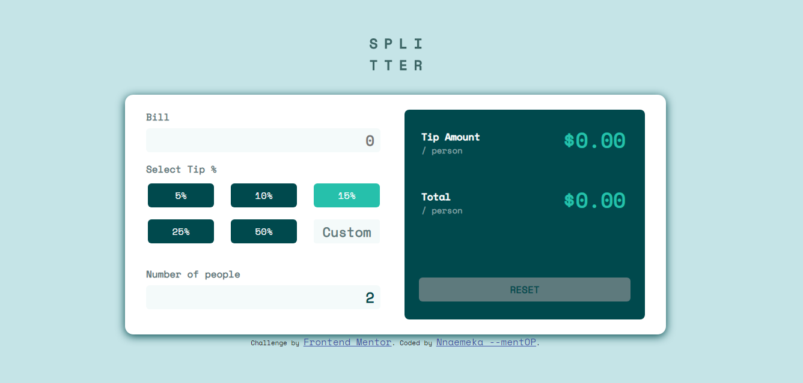

# Frontend Mentor - Tip calculator app solution

This is a solution to the [Tip calculator app challenge on Frontend Mentor](https://www.frontendmentor.io/challenges/tip-calculator-app-ugJNGbJUX). Frontend Mentor challenges help you improve your coding skills by building realistic projects.

## Table of contents

- [Overview](#overview)
  - [The challenge](#the-challenge)
  - [Screenshot](#screenshot)
  - [Links](#links)
- [My process](#my-process)
  - [Built with](#built-with)
  - [What I learned](#what-i-learned)
  - [Useful resources](#useful-resources)
- [Author](Nnaemeka)
- [Acknowledgments](Chidera Okereke, John Obioma)


## Overview

### The challenge

Users should be able to:

- View the optimal layout for the app depending on their device's screen size
- See hover states for all interactive elements on the page
- Calculate the correct tip and total cost of the bill per person

### Screenshot



### Links

- Solution URL: [https://github.com/Nnaemeka10/miniprojects-splitter]
- Live Site URL: [https://splitter-topaz.vercel.app/]

## My process

### Built with

- Semantic HTML5 markup
- CSS custom properties
- Flexbox
- CSS Grid
- Mobile-first workflow


### What I learned

```js
function calcTip(percent) {
    if(percent == 0){
        return
    }else{
        tipPerson=((eval(bill.value)/eval(people.value)*percent)/100).toFixed(2)
        totalPerson=((eval(bill.value)/eval(people.value))+eval(tipPerson)).toFixed(2);
        if(totalPerson.length>4){
            totalPerson = totalPerson.substring(0,5)
            total.value=`$${totalPerson}`
        }if(totalPerson.length < 5){
            total.value=`$${totalPerson}`
        }
        if(tipPerson.length>4){
            tipPerson = tipPerson.substring(0,5)
            tip.value=`$${tipPerson}`
        }if(tipPerson.length < 5){
            tip.value=`$${tipPerson}`
        }
    }
};
```


### Useful resources

- [https://developer.mozilla.org/en-US/] - This helped me alot. I really liked their nice explanations and will use it going forward.


## Author

- Facebook - [https://www.facebook.com/nnaemeka.egbucha]
- Frontend Mentor - [https://www.frontendmentor.io/profile/nnaemeka10]


## Acknowledgments

Chidera, your help was appreciated.
    John, your help was appreciated

